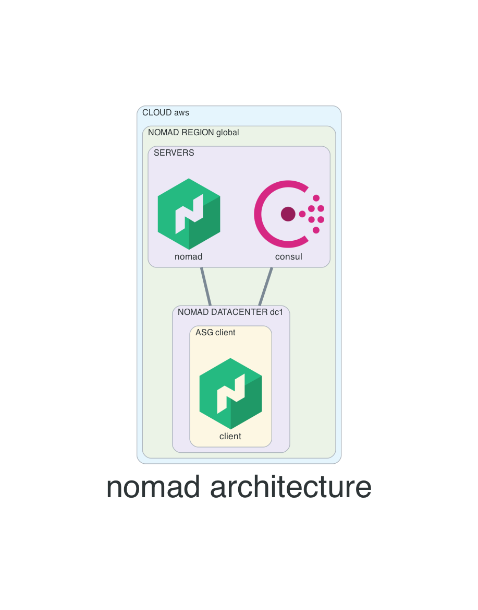

# nomad-aws
Nomad cluster following [nomad architecture reference](https://learn.hashicorp.com/tutorials/nomad/production-reference-architecture-vm-with-consul?in=nomad/enterprise)

## Diagram


## How to use this repo
- Clone this repo
```
git clone https://github.com/ion-onboarding/nomad-aws.git
```

- change directory
```
cd nomad-aws
```

## License (optional)
- create license files
```
touch ./licenses/consul.hclic
touch ./licenses/nomad.hclic
touch ./licenses/vault.hclic
```

- add license
```
echo "CONSUL-LICENSE" > ./licenses/consul.hclic
echo "NOMAD-LICENSE" > ./licenses/nomad.hclic
echo "VAULT-LICENSE" > ./licenses/vault.hclic
```

- modify variables __`consul_enterprise_enabled`__, __`nomad_enterprise_enabled`__ & __`vault_enterprise_enabled`__
  - __true__: install enterprise version
  - __false__: install OSS version

see file `ec2-variables.tf`

## Specific version (optional)
- install version `x.y.z`
   - consul: set variable consul_version=`x.y.z`
   - nomad: set variable nomad_version=`x.y.z`
   - vault: set variable vault_version=`x.y.z`

see file `ec2-variables.tf`

## Create infrastructure
- initialize working directory
```
terraform init
```

- plan, to see what resources will be create
```
terraform plan
```

- create resources
```
terraform apply
```

## How to connect?
- use terraform output to get:
  - www load balancer
  - export ENV variables for consul, vault, nomad
  - ssh details `(if bastion host enabled)`
```
terraform output
```

## Destroy infrastructure
- destroy resources
```
terraform destroy
```

# Server details

## Consul
- members
```
consul members
```

- raft peers
```
consul operator raft list-peers
```

## Vault
- GUI user password (root privilege)
```
username: admin
password: admin
```
- status
```
vault status
```

- login on the CLI
```
vault login -method=userpass username=admin password=admin
```

- export VAULT_TOKEN
```
export VAULT_TOKEN=<token>
```

- lookup token being used
```
vault token lookup
```

- servers (raft)
```
vault operator raft list-peers
```

## Nomad
- servers
```
nomad server members
```

- nodes
```
nomad node status
```

- raft peers
```
nomad operator raft list-peers
```

- to run nomad jobs drive into __examples__ directory